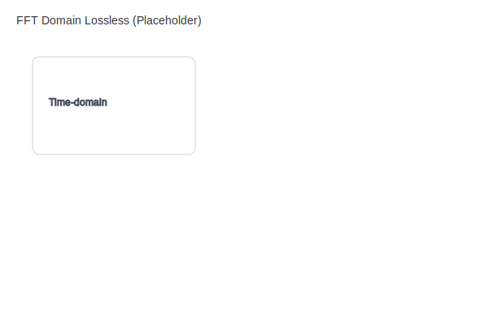

# FFT Compression Evaluation

**Project:** no-sdr  
**Status:** Complete — deflate (delta+zlib) selected as default codec




---

## Implemented FFT Codec Pipeline

```
FftProcessor.processIqData(rawIQ)
    │
    ▼ Float32Array (dB magnitudes, N bins)
    │
    ├─── compressFft() ─────────────────► Uint8 (quantize to 0-255)
    │       │                               4:1 vs Float32
    │       │
    │       ├─── packCompressedFftMessage() ─► MSG_FFT_COMPRESSED (0x04)
    │       │                                  [Int16 min, Int16 max, Uint8[N]]
    │       │
    │       ├─── delta-encode ──► deflateRaw(level 6) ──► MSG_FFT_DEFLATE (0x0B)
    │       │                     [Int16 min, Int16 max, Uint32 N, deflate bytes]
    │       │                     7.5–10:1 vs Float32 (LOSSLESS from Uint8 stage)
    │       │
    │       └─── noise floor EMA ──► clamp ──► delta ──► deflateRaw ──► deflate-floor variant
    │
    └─── encodeFftAdpcm() ──────────► IMA-ADPCM on Int16(dB×100)
                                       ~8:1 vs Float32
                                       MSG_FFT_ADPCM (0x08)
```

## Codec Comparison (measured)

| Codec | Type | Ratio vs Float32 | Latency | Default |
|-------|------|------------------|---------|---------|
| `none` | Raw Uint8 | 4:1 | Negligible | No |
| `adpcm` | Lossy | ~8:1 | ~0.2ms sync | No |
| `deflate` | Lossless (from Uint8) | 7.5–10:1 | ~1ms async (libuv) | **Yes** |
| `deflate-floor` | Lossless + noise floor | 7.5–10:1 | ~1ms async | No |

## Why Deflate Won

1. **Lossless at the Uint8 stage** — no additional quantization loss beyond the Float32→Uint8 mapping
2. **Delta encoding exploits spectral coherence** — adjacent FFT bins differ by small amounts, delta values cluster near zero, ideal for deflate
3. **Async via libuv thread pool** — zlib deflateRaw runs off the Node.js event loop (no CPU blocking)
4. **Better ratio than ADPCM** — 7.5–10:1 vs ~8:1, without the lossy step-size drift artifacts

## Why ADPCM is Still Offered

- Deterministic latency (sync, no thread pool contention)
- Lower CPU on very constrained servers
- Decode is simpler on client (no inflate)

## Client-Side Decode

All FFT decompression runs in a dedicated Web Worker (`fft-decode.worker.ts`):
- `MSG_FFT_DEFLATE` → `fflate.inflateSync()` → delta-decode → Uint8→Float32 expand
- `MSG_FFT_ADPCM` → `decodeFftAdpcm()` → Float32
- `MSG_FFT_COMPRESSED` → Uint8→Float32 expand (header min/max)

Zero decode work on the main thread.

## Benchmark Script

`scripts/benchmark-fft-compression.ts` — tests ADPCM encode/decode round-trip, Uint8 quantization accuracy, and throughput. Run with `npx tsx scripts/benchmark-fft-compression.ts`.

## Future Considerations

- **Kaiser window + slow-scan integration** — multi-frame FFT averaging before compression would further reduce delta variance and improve deflate ratio
- **WebCodecs API** — if browsers expose hardware deflate, client decode could be offloaded to GPU
