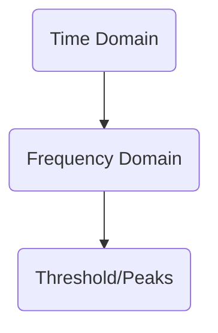
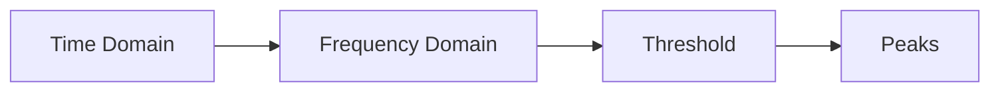

# FFT Compression Evaluation

The FFT benchmark provides a performance comparison of various general-purpose and specialized compression algorithms applied to IQ (In-phase and Quadrature) samples.

## Table of Contents
- [Overview](#overview)
- [Benchmark Findings](#benchmark-findings)
- [Proposed Additions](#proposed-additions)
- [Visual Aids](#visual-aids)
- [Glossary](#glossary)
- [Recommendation](#recommendation)

## Overview
- In SDR, IQ samples are raw, high-bit-depth streams of complex numbers. Standard lossless compressors (e.g., ZLib, LZ4) often underperform on RF data due to noise-like characteristics.

## Benchmark Findings
- Current Focus: Tests lossless and generic algorithms.
- Pros: Establishes CPU overhead vs. compression ratio baseline. Fast compressors like LZ4 offer minimal compression; more advanced like Zstd/LZMA trade latency for better ratios.
- Cons: Lacks context-aware or physics-aware compression; ignores correlations between I and Q and temporal waveform structure.

## Proposed Additions
### 1. Domain-Specific Lossless: Linear Predictive Coding (LPC)
- Description: Exploit signal physics; store residuals (actual - predicted).
- Why: Residuals have smaller dynamic range, enabling better entropy coding.

### 2. Quantization & Bit-Reduction (Near-Lossless)
- Bit-Grooming: Mask LSBs that are noise to increase run-lengths for compressors.
- A-Law / μ-Law: Use logarithmic quantization to preserve small signals while reducing bit depth.

### 3. Frequency-Domain Compression (Lossy but Effective)
- FFT and discard bins below a dB threshold to store only spectral peaks, enabling high compression for sparse spectrums.

### 4. Complex-Value Aware Transform (Wavelets)
- Use a DWT designed for complex numbers to capture transients and carriers more effectively.

### 5. Machine Learning Autoencoders
- Train encoders/decoders for specific protocols to learn latent representations and improve compression.

- ## Visual Aids
- Inline Mermaid diagrams are provided below for quick reference.

## Contribute Visuals
- Choose a diagram type (Mermaid inline or SVG image).
- Place assets under docs/images or docs/visuals.
- Update this document to reference the visuals and include Mermaid blocks as needed.
- Open a PR with the visuals, including a short description of the diagram’s purpose.

## Glossary
- IQ: In-phase and Quadrature components.
- FFT: Fast Fourier Transform.
- LPC: Linear Predictive Coding.
- Bit-Grooming: Removing noisy LSBs to improve compression.
- EVM: Error Vector Magnitude.
- SNR: Signal-to-Noise Ratio.

## Recommendation
- Extend the no-sdr benchmark with a Signal Quality Metrics section. Measure EVM or SNR degradation alongside compression ratio to assess signal integrity after compression.

(End of file)
