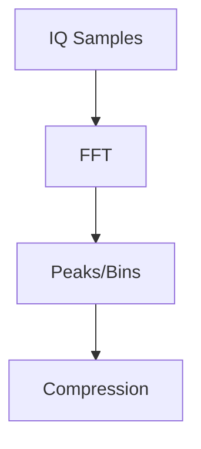

# FFT Visuals

This document contains Mermaid diagrams for FFT-related visualizations.

## Mermaid Diagrams (inline)

## How to Contribute Visuals
- Create a Mermaid diagram or an SVG illustration.
- Save assets under docs/images or docs/visuals.
- Reference diagrams in the main FFT doc via links or inline Mermaid blocks.
