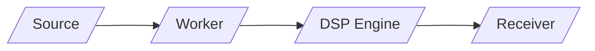
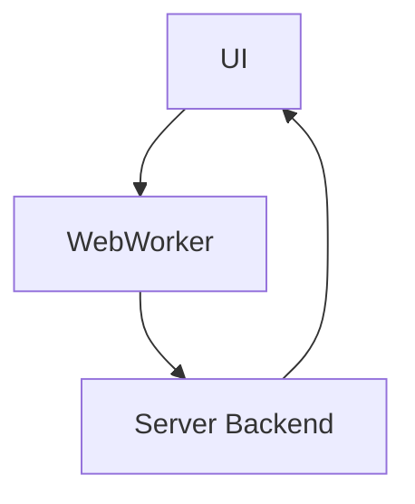

# No-SDR Spec Evaluation

The no-sdr specification outlines a modular, web-first approach to SDR that focuses on offloading heavy DSP from the browser to specialized "Worker" nodes while maintaining a lightweight, cross-platform interface.

## Table of Contents
- [Architectural Pivots](#architectural-pivots)
- [Visual Aids](#visual-aids)
- [Glossary](#glossary)
- [Contribute Visuals](#contribute-visuals)

## Architectural Pivots
- Unified Telemetry-First Compression API: Standardize a signal-aware compression layer to switch algorithms based on stream type (visual/FFT, audio, raw).
- Headless Flow-Graph Engine: Support a headless execution mode where a JSON-defined DSP flow graph can run on a server or Raspberry Pi without an active browser.
- Progressive Signal Enhancement (LoD): Implement Level of Detail to deliver low-bandwidth overviews and progressively high-resolution IQ data for zoomed-in frequency regions.
- Zero-Copy WebWorker Integration: Minimize data copies between UI and workers using transferable objects and shared buffers where possible.

## Visual Aids
### Inline Mermaid Diagrams

Notes: Inline diagrams for quick reference. Replace with SVGs if you prefer image assets.

### External Visuals (SVGs)
- See No-SDR Visuals: docs/no-sdr-visuals.md
- See FFT Visuals: docs/fft-visuals.md

## Glossary
- SDR: Software Defined Radio.
- IQ: In-phase and Quadrature components representing a complex sample.
- LPC: Linear Predictive Coding, a lossless predictive coding technique for signals.
- LoD: Level of Detail, a progressive fidelity strategy for spectrum data.
- WebWorker: A browser background thread used to offload heavy DSP work from the main UI thread.
- Flow Graph: A JSON-defined chain of DSP blocks that can be deployed to run standalone.

## Contribute Visuals
- Choose a diagram type (Mermaid inline or SVG image).
- Place assets under docs/images or docs/visuals.
- Update this document to reference the visuals and include Mermaid blocks as needed.
- Open a PR with the visuals, including a short description of the diagram’s purpose.

## Cross-References
- Related visuals: No-SDR Visuals (docs/no-sdr-visuals.md) and FFT Visuals (docs/fft-visuals.md).
