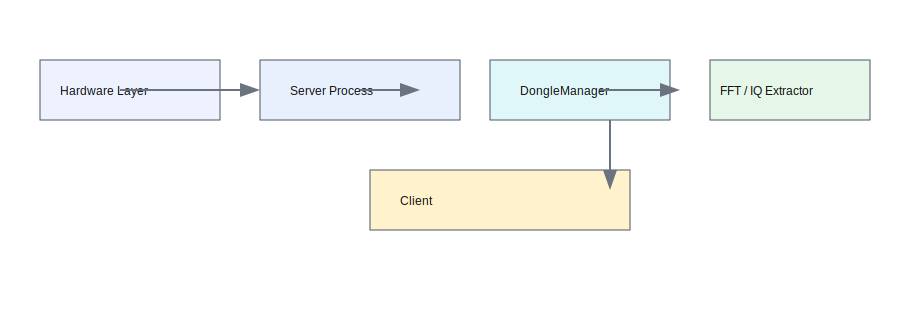
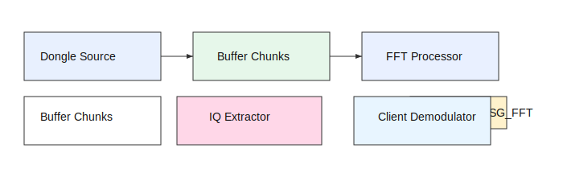
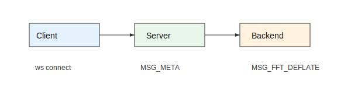
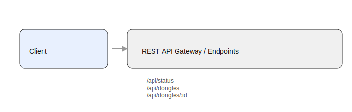
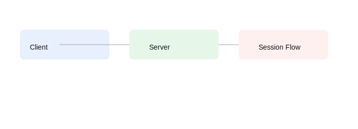
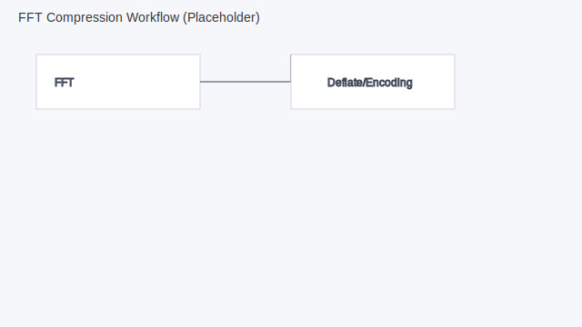

# no-sdr Architecture Evaluation

**Project:** no-sdr  
**Date:** April 2026  
**Source:** graphify knowledge graph analysis (869 nodes, 1221 edges, 41 communities)

---

## Visual References

| Diagram | File |
|---------|------|
| Architecture overview |  |
| Data flow (dongle → client) |  |
| WebSocket protocol flow |  |
| REST API flow |  |
| Session lifecycle |  |
| FFT compression workflow |  |

---

## System Architecture

```
┌──────────────────────────────────────────────────────────────────────┐
│  Hardware Layer                                                        │
│  ├─ local: spawn rtl_sdr (uint8 IQ stdout)                           │
│  ├─ rtl_tcp: TCP client to remote rtl_tcp server                     │
│  ├─ airspy_tcp / hfp_tcp / rsp_tcp: network SDR sources              │
│  └─ demo: SignalSimulator (fake IQ)                                   │
└───────────┬──────────────────────────────────────────────────────────┘
            │ Buffer chunks (uint8 interleaved I/Q)
┌───────────▼──────────────────────────────────────────────────────────┐
│  Server (Node.js / Hono)                                              │
│                                                                        │
│  DongleManager ─────────► FftProcessor (1× per dongle, shared)        │
│       │                        │ Float32 dB → codec encode            │
│       │                        ▼                                       │
│       │                   WebSocketManager                             │
│       │                        │ FFT broadcast (deflate/adpcm/uint8)  │
│       │                        │                                       │
│       └───────────────► IqExtractor (1× per client)                   │
│                               │ NCO + Butterworth + decimate           │
│                               ▼                                        │
│                         ┌─────┴──────┐                                 │
│                         │ IQ codec   │ Opus pipeline                   │
│                         │ none/adpcm │ demod + encode                  │
│                         └────────────┘ (server-side)                   │
└───────────┬──────────────────────────────────────────────────────────┘
            │ WebSocket (binary, type-byte prefix)
┌───────────▼──────────────────────────────────────────────────────────┐
│  Client (SolidJS / Vite)                                              │
│                                                                        │
│  SdrEngine (orchestrator, 87 connections)                             │
│       │                                                                │
│       ├─ fftDecodeWorker ──► WaterfallWorker (OffscreenCanvas)        │
│       │                  └─► SpectrumRenderer (Canvas 2D, 30fps)      │
│       │                                                                │
│       ├─ Demodulators: FM stereo / AM / C-QUAM / SAM / SSB / CW      │
│       │                                                                │
│       ├─ Audio filters: LMS ANR, Auto-Notch, Rumble, Hi-Blend, AGC   │
│       │                                                                │
│       ├─ RDS Decoder (57kHz BPF → NCO → biphase → group parser)      │
│       │                                                                │
│       └─ AudioEngine (AudioWorklet + 5-band EQ + jitter buffer)       │
└──────────────────────────────────────────────────────────────────────┘
```

## God Nodes (architectural hubs)

| Node | Degree | Role |
|------|--------|------|
| SdrEngine | 87 | Client orchestrator — connects WS, renderers, audio, demod |
| DongleManager | 32 | Server dongle lifecycle (5 source types) |
| WebSocketManager | 28 | Binary protocol routing, per-client codec dispatch |
| AudioEngine | 21 | AudioWorklet pipeline, EQ, jitter buffer |
| SpectrumRenderer | 19 | Canvas 2D spectrum display |
| WaterfallRenderer | 17 | Canvas 2D waterfall (via Worker) |
| OpusAudioPipeline | 12 | Server-side demod + Opus encode |

## Key Architectural Decisions

### Hybrid DSP (server FFT, client demod)
- **Why:** FFT is shared across all clients (compute once, broadcast N). Demodulation is per-user (different frequency offsets). This minimizes server CPU growth per user.
- **Trade-off:** Requires sending IQ sub-bands per client (~192 KB/s NFM, ~960 KB/s WFM). Mitigated by ADPCM (4:1) and Opus (server-side demod for constrained links).

### Dual codec paths (IQ vs Opus)
- **IQ path:** Full client-side DSP — stereo FM, NR, EQ, RDS all work. Higher bandwidth.
- **Opus path:** Server does demod + Opus encode. Ultra-low bandwidth (~24 KB/s total). No client NR/EQ control, but works on 3G connections.

### Client Workers for rendering
- **fftDecodeWorker:** Decompresses FFT frames off main thread
- **fftAnalysisWorker:** Computes auto-scale dB range
- **waterfallWorker:** Renders via OffscreenCanvas (zero main-thread paint)

### Per-client IqExtractor (server)
- Each client gets independent NCO + Butterworth IIR + decimation
- Output rate varies by mode: WFM=240k, NFM/AM=48k, SSB=24k, CW=12k
- 20ms accumulation buffer before send (fixed chunk sizes)

## Performance Bottleneck Map

| Operation | Cost per chunk | Scales with | Mitigation |
|-----------|---------------|-------------|-----------|
| FFT (N=65536) | ~4ms | FFT size | Rate-capped at targetFps (default 30) |
| IqExtractor | ~0.5ms | # audio clients | Candidate for worker_threads |
| OpusAudioPipeline | ~2-3ms | # opus clients | Candidate for worker_threads |
| deflateRaw | ~1ms | 1× (shared) | Already async (libuv pool) |

## Community Structure (from graphify)

| Community | Members | Cohesion | Description |
|-----------|---------|----------|-------------|
| Client Demodulators | 93 | 0.04 | AM/FM/SSB/SAM/C-QUAM demod classes |
| Server Core | 89 | 0.03 | Config, dongle-manager, fft-processor, index |
| SDR Engine | 89 | 0.04 | Client orchestration + state management |
| UI Components | 68 | 0.03 | App shell, admin modal, controls |
| Binary Protocol | 45 | 0.09 | pack/unpack functions, codec types |
| Hardware Docs | 44 | 0.06 | Integration roadmap + benchmark docs |
| Dongle Manager Ops | 43 | 0.07 | DongleManager methods (TCP connect, profiles) |
| Server RDS | 42 | 0.07 | Server-side RDS decoder (opus path) |
| Client RDS | 42 | 0.07 | Client-side RDS decoder (IQ path) |
