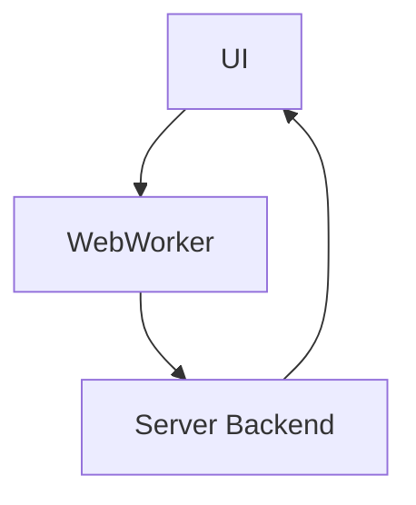

# No-SDR Visuals

This document contains Mermaid diagrams and guidance for No-SDR visuals.

## Mermaid Diagrams (inline)

## How to Contribute Visuals
- Create a Mermaid diagram or an SVG illustration.
- Save assets under docs/images or docs/visuals.
- Reference diagrams in the main docs via links or inline Mermaid blocks.

## Cross-References
- FFT Compression Evaluation visuals: docs/fft-visuals.md
