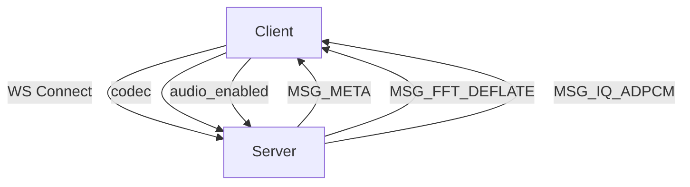
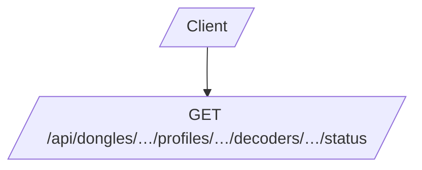

# SPEC Visuals

This document hosts architecture and data-flow diagrams for the no-sdr SPEC, primarily using Mermaid for readability and maintainability.

## 16. Visuals Overview

### 16.1 Architecture Diagram (Mermaid)
```mermaid
graph TD;
  HW[Hardware Layer] --> Server[Server Process (Node.js)];
  Server --> DongleMgr[DongleManager];
  DongleMgr --> Fft[FFT Processor];
  DongleMgr --> Iq[IQ Extractor];
  Server --> WS[WebSocketManager];
  Client[Client (Browser)] --> WS;
```

### 16.2 Data Flow
```mermaid
graph TD;
  subgraph SharedPath[Shared path (all clients on a dongle)]
    DongleSource[Dongle source] --> Buffer[Buffer chunks]
    Buffer --> FftProcessor[FftProcessor]
    FftProcessor --> FftDB[Float32 dB]
    FftDB --> WS[WebSocket MSG_FFT]
    WS --> Client1[Client waterfall/spectrum]
  end
  subgraph PerUser[Per-user path]
    DongleSource --> IqExtractor[IqExtractor]
    IqExtractor --> IQ[Int16 IQ]
    IQ --> MSG_IQ[WebSocket MSG_IQ]
  end
  end
```

### 16.3 WebSocket Protocol (Overview)


### 16.4 REST Endpoints (Overview)


### 16.5 Visual Fidelity Guidelines
- Mermaid is the preferred inline visual language for maintainability.
- Prefer inline Mermaid blocks over external assets for long-term viability.
- Provide captions and alt-text parity for accessibility where possible.
- Keep diagrams concise (200–400 lines of code per diagram) and well-labeled.
